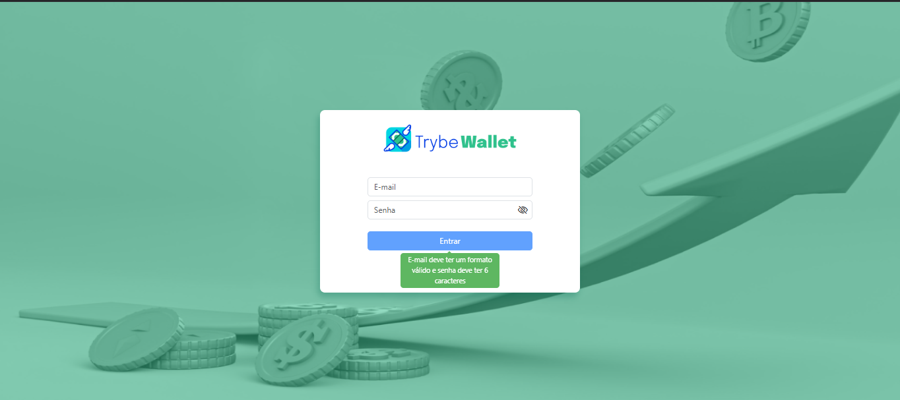
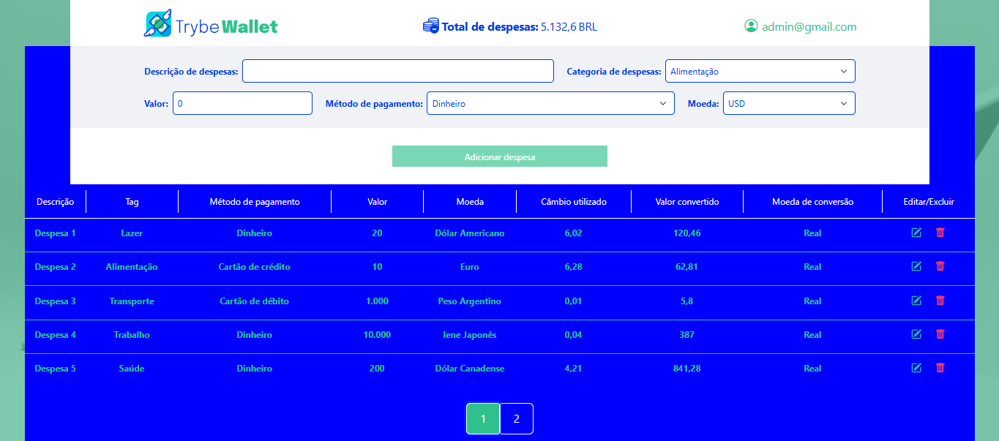

# TrybeWallet

  
Preview

  

  <h3>Login:<h3/>
  
  <h3>Wallet:<h3/>
  
  

    
### Veja a aplicação funcionando <a title="https://isaque-s-0liveira.github.io/TrybeWallet-ts/" role="link" target="_blank" rel="noopener noreferrer nofollow" class="text-bold" href="https://isaque-s-0liveira.github.io/TrybeWallet-ts/">clicando aqui</a>

## Contexto

O principal objetivo deste projeto é consolidar os conhecimentos adquiridos sobre **React** e **Redux** durante o curso da **Trybe**, com ênfase na criação e gerenciamento de estados globais. O projeto abrange desde a configuração inicial do **Redux**, até a utilização de seus principais conceitos, como **store**, **reducers**, **actions** e **dispatchers**, promovendo um fluxo de dados previsível e eficiente.

Além disso, foram utilizados os **hooks do Redux**, como `useSelector` e `useDispatch`, para facilitar a manipulação e leitura do estado global dentro dos componentes React. Por fim, para garantir a qualidade do código, o projeto inclui testes automatizados utilizando a biblioteca **React Testing Library**, integrados com Redux, para verificar o funcionamento das funcionalidades implementadas.

### Habilidades desenvolvidas:

- Configuração e uso do **Redux** em uma aplicação React.
- Criação de **store**, **reducers**, **actions** e **dispatchers** para gerenciar estados globais.
- Utilização de **Redux hooks** (`useSelector`, `useDispatch`) para conectar componentes ao estado global.
- Escrita de testes automatizados com **React Testing Library** em conjunto com Redux para validar fluxos e interações.

  
O que é a Trybe?🤔

  A Trybe é uma escola de desenvolvimento web genuinamente comprometida com o sucesso profissional de seus estudantes. Com o Modelo de Sucesso Compartilhado (MSC) oferecido pela Trybe Fintech, uma instituição financeira autorizada pelo Banco Central do Brasil, os alunos têm a opção de pagar apenas quando estiverem trabalhando.

---
O TrybeWallet é uma aplicação responsiva de controle de gastos com conversor de moedas. As principais funcionalidades do TrybeWallet incluem:

-  Adicionar, remover e editar um gasto.
-  Visualizar sua tabela de gastos.
-  Visualizar o total de gastos convertidos para uma moeda de sua escolha.
---

## Técnologias usadas

- [React](https://reactjs.org/)
- [Redux](https://react-redux.js.org/using-react-redux/usage-with-typescript)
- [React Router](https://reactrouter.com/en/main)
- [TypeScript](https://www.typescriptlang.org/)
- [Bootstrap 5](https://getbootstrap.com/)
- [React Testing Library](https://testing-library.com/docs/react-testing-library/intro/)
- CSS3

## Entre em contato:

